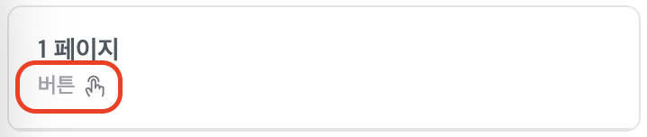

# 요구사항

## 목적

- 실제로 세일즈클루에서 사용되고있는 컴포넌트들을 구현하여, 실제 프로덕트에서 어떻게 구현하는지 경험할 수 있어요.
  - 이를 통해 지원자 분께서 어떻게 컴포넌트를 만드는 지 확인해요.
- `React.js` + `TypeScript` 보일러플레이트 코드와 몇 개의 컴포넌트를 제공하고 있습니다. 이를 바탕으로 기존의 코드를 충분히 활용하여 개발하는 지 확인해요.

## 평가 기준

- 요구사항을 바르게 이해하고, 적절하게 구현 되었는지 판단해요.
- 비동기 요청을 어떻게 구현 하는지 판단해요.
  - 선언적으로 비동기를 어떻게 처리하는지 판단해요.
- 컴포넌트 추상화의 정도를 판단해요.

## 기술 스택

저희 세일즈클루에서는 아래와 같은 기술 스택을 사용하고 있어요.

- React, Next.js, TypeScript
- Jotai, React-Query
- Emotion
- React Hook Form

과제는 아래와 같은 기술 스택을 사용하고 있어요.

- Create React App(`React.js` + `TypeScript`)
- Emotion

참고해주세요!

- 저희 세일즈클루가 사용하는 기술스택과 지원자님의 기술스택이 달라도 상관 없어요.
  - 자신있는 기술스택을 활용하여도 문제 없습니다.
- 기타 추가적인 라이브러리를 사용한다면, 자유롭게 사용 가능해요.

## 과제 제출 순서

1. 이메일로 첨부드린 과제의 압축을 풀고 깃헙의 Private Repository를 생성해주세요.
2. `assignment` 브랜치를 생성하여 작업하고, `main` 브랜치에 Pull Request를 보내주세요.
   **반드시 브랜치를 나눠서 작업해주세요!**
3. 위의 과정을 마무리 하셨다면, `pairy-sun`을 초대해주세요.

## 요구사항

구현한 부분을 Pull Request의 Template에 작성해주세요.

만약 요구사항 이외의 추가적인 구현사항이 있는 경우에도 Pull Request의 Template에 그 이유와 설명을 적어주세요.

적절한 메세지와 함께 작은 단위로 커밋해주세요.

> 💡 해당 프로젝트의 api 정보와 타입 관련 정보들은 `src/_mocks/handler.ts`에 정의되어있습니다!

### 페이지 목록 불러오기

1. api 요청을 통해 페이지 목록을 렌더링한다.
2. 각 페이지에 CTA 버튼이 있으면 페이지 아래에 ‘버튼’이라는 문구와 함께 아이콘을 렌더링한다.

   

3. 페이지를 클릭하면 우측에 CTA 링크를 생성하는 폼을 렌더링한다.
   1. 페이지를 클릭하기 전에는 우측에 CTA 링크 생성하는 폼이 보여지지 않는다.
   2. 동시에 클릭한 페이지의 className에 `is-selected`를 설정한다.

### CTA 링크 생성하기

1. ‘변경사항 저장하기’ 버튼은 위의 두개의 필드 중 하나라도 유효성 검사가 실패하면 비활성화 된다.
2. ‘버튼 이름’ 필드 유효성 검사 목록
   1. 필수로 입력되어야 한다.
   2. 한글자 이상 스무글자 이하로 입력되어야한다.
3. ‘버튼에 연결될 링크’ 필드 유효성 검사 목록
   1. 필수로 입력되어야 한다.
   2. 링크 맨 앞에 반드시 프로토콜(`http://` 또는 `https://`)이 붙어야한다.
   3. 프로토콜 뒤에 호스트가 붙어야하며 맨 앞에 `www`가 없어도 만족한다.
      example: [https://www.salesclue.io](https://www.salesclue.io) (o), [https://salesclue.io](https://salesclue.io) (o)
4. ‘변경사항 저장하기’ 버튼 클릭 시 링크 생성 api를 요청한다.
   1. api 요청이 성공이면, 최신의 데이터를 확인할 수 있도록 페이지 목록 api를 불러온다.

### CTA 링크 수정하기

1. 기존에 링크가 있었던 페이지에서만 수정할 수 있다.
2. 페이지에서 기존의 링크 정보와 일치한 상태에서 수정하지 않도록 버튼을 비활성화한다.
   1. 기존의 링크 정보와 다른 경우 버튼이 활성화된다.
   2. api 요청이 성공이면, 최신의 데이터를 확인할 수 있도록 페이지 목록을 불러온다.

## 기타

- 과제 관련하여 궁금하신 사항이 있다면, 언제든지 작업하고 있는 레파지토리에 `pairy-sun`을 초대하여 이슈에 궁금하신 사항을 작성하고 멘션해주세요.
- 과제 기간 관련하여 조정이 필요하시면 언제든지 메일(subin@salesclue.io)로 문의를 남겨주세요.
